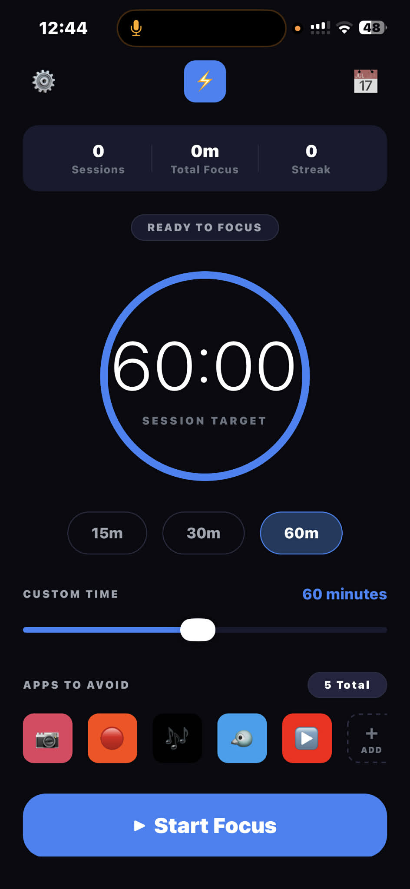
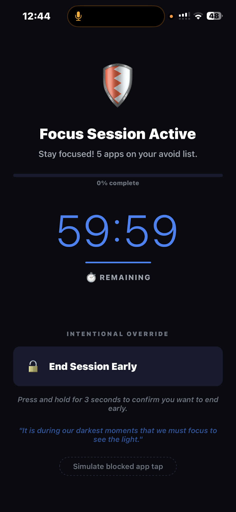
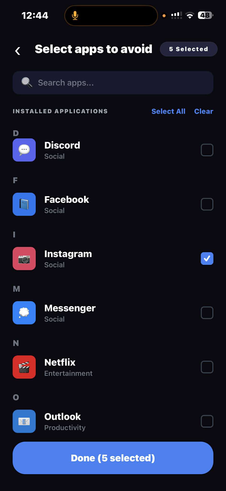
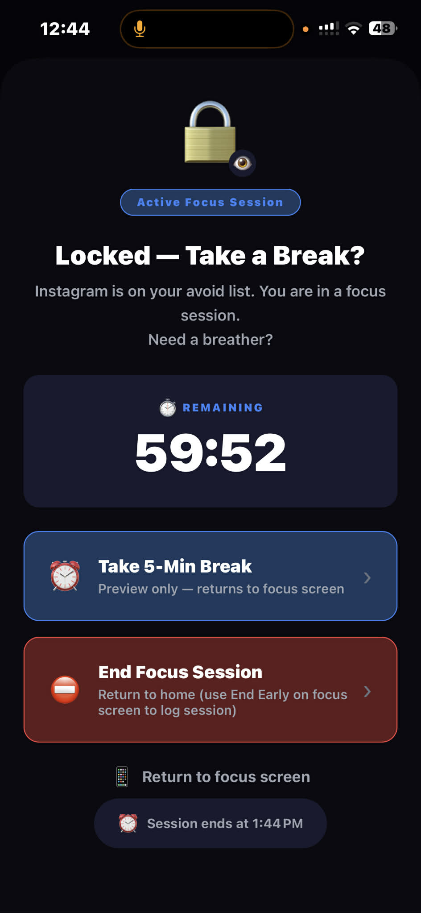

# LockerApp

A personal focus timer for iOS and Android built with React Native and Expo. Set a session duration, pick apps you want to stay away from, start the countdown, and track your daily focus streaks — all stored locally on your device with no account required.


---

## Features

- **Focus timer** — set a session from 5 to 120 minutes using quick presets (15 / 30 / 60 min) or a custom slider
- **Apps-to-avoid list** — browse a catalog of common apps, search, select the ones that distract you most; your choices persist between sessions
- **Active session screen** — large countdown, progress bar, motivational quote, and a 3-second long-press to end early (prevents accidental taps)
- **Locked prompt modal** — preview of what a "blocked app" warning looks like; shows remaining session time and a live session-end estimate
- **Local stats** — total sessions, completed sessions, total focus minutes, current daily streak, and longest streak — all calculated from on-device history
- **Persistent preferences** — default duration and selected apps survive app restarts via AsyncStorage
- **Dark UI** — dark theme throughout, portrait-only, no tablet support

---

## Screenshots

<p align="center">
  
  
  
  
</p>

<p align="center">
  <sub>Home &nbsp;&nbsp;&nbsp;&nbsp;&nbsp;&nbsp;&nbsp;&nbsp;&nbsp;&nbsp;&nbsp;&nbsp;&nbsp;&nbsp;&nbsp;&nbsp; Focus Active &nbsp;&nbsp;&nbsp;&nbsp;&nbsp;&nbsp;&nbsp;&nbsp;&nbsp;&nbsp;&nbsp;&nbsp;&nbsp; App Selection &nbsp;&nbsp;&nbsp;&nbsp;&nbsp;&nbsp;&nbsp;&nbsp;&nbsp;&nbsp;&nbsp; Locked Prompt</sub>
</p>

---

## Tech Stack

| Layer | Choice |
|---|---|
| Framework | React Native 0.81 / Expo SDK 54 |
| Language | TypeScript (strict) |
| Navigation | React Navigation v7 (native stack) |
| Persistence | `@react-native-async-storage/async-storage` |
| SVG | `react-native-svg` (circular timer ring) |
| Slider | `@react-native-community/slider` |
| Web target | `react-native-web` + `@expo/metro-runtime` |

---

## Project Structure

```
LockerApp/
├── App.tsx                         # Root: SafeAreaProvider + AppNavigator
├── index.ts                        # Expo entry point
├── app.json                        # Expo config (dark, portrait, slug)
├── assets/                         # App icons, splash image, favicon
├── src/
│   ├── theme/
│   │   └── index.ts                # Colors, spacing, fontSize, borderRadius
│   ├── types/
│   │   └── index.ts                # AppInfo, FocusSession, UserPreferences, FocusStats, RootStackParamList
│   ├── data/
│   │   └── apps.ts                 # Dummy app catalog (15 apps, categories, icons)
│   ├── services/
│   │   └── storage.ts              # AsyncStorage CRUD: preferences, sessions, stats, streak logic
│   ├── hooks/
│   │   └── useFocusSession.ts      # React hook wrapping storage service
│   ├── navigation/
│   │   └── AppNavigator.tsx        # Stack: Onboarding → Home → AppSelection / FocusActive / LockedPrompt
│   ├── components/
│   │   ├── CircularTimer.tsx       # SVG ring timer
│   │   ├── PillBadge.tsx           # Status pill (default / active / count variants)
│   │   ├── AppIcon.tsx             # Rounded emoji icon with optional label
│   │   ├── ActionCard.tsx          # Tappable card (primary / danger variants)
│   │   └── TimePresetButton.tsx    # Preset duration pill button
│   └── screens/
│       ├── OnboardingScreen.tsx    # Welcome + Get Started (skips if already seen)
│       ├── HomeScreen.tsx          # Hub: stats bar, timer ring, presets, app row, Start Focus
│       ├── AppSelectionScreen.tsx  # Sectioned list with search, Select All / Clear, Done saves to storage
│       ├── FocusActiveScreen.tsx   # Countdown, progress bar, long-press end early, saves session
│       └── LockedPromptScreen.tsx  # Modal: remaining time, "session ends at", action cards
└── database/
    └── schema.sql                  # PostgreSQL schema (future backend reference — not connected)
```

---

## Data Model

All data lives in AsyncStorage under two keys:

| Key | Type | Description |
|---|---|---|
| `@lockerapp:preferences` | `UserPreferences` | Default duration, selected app IDs, onboarding flag |
| `@lockerapp:sessions` | `FocusSession[]` | Rolling history, capped at 200 entries |

Stats (streak, total minutes, completion rate) are computed on read from the sessions array — no separate storage needed.

---

## Getting Started

### Prerequisites

- Node.js 20+
- npm or yarn
- [Expo Go](https://expo.dev/go) on your phone **or** a web browser

### Install and run

```bash
git clone https://github.com/<your-username>/LockerApp.git
cd LockerApp
npm install

# Web browser (no phone needed)
npm run web

# Expo Go on your phone (scan QR code)
npm start
```

### Type check

```bash
npm run typecheck
```

---

## Navigation Flow

```
Onboarding
    │  (first launch only)
    ▼
Home ──────────────────────────┐
    │                          │
    │  [Select apps]           │  [reload on focus]
    ▼                          │
AppSelection ─── Done ─────────┘
    │
Home ──── [Start Focus] ────► FocusActive
                                    │
                                    │  [Simulate blocked tap]
                                    ▼
                              LockedPrompt (modal)
                                    │
                                    └── goBack → FocusActive
                                    └── popToTop → Home
```

---

## Docker (Web Version)

The web export of LockerApp can be containerized and served via Nginx. This lets anyone run the app locally without installing Node.js or Expo.

> **What you get:** The full UI running in a browser. AsyncStorage falls back to `localStorage` on web, so preferences and session history still persist between page refreshes.

### Prerequisites

- [Docker Desktop](https://www.docker.com/products/docker-desktop/) installed and running

### Production container (recommended)

```bash
# Build image and start on port 3000
npm run docker:up
# or manually:
docker compose up --build
```

Then open **http://localhost:3000** in your browser.

### One-liner (without docker compose)

```bash
npm run docker:build   # builds image tagged "lockerapp"
npm run docker:run     # runs on http://localhost:3000
```

### Dev server with hot reload inside Docker

```bash
npm run docker:dev
# Metro bundler available at http://localhost:8081
```

### File overview

| File | Purpose |
|---|---|
| `Dockerfile` | Multi-stage build: Node 20 builds the static bundle → Nginx 1.27 serves it |
| `nginx.conf` | SPA routing fallback, 1-year asset caching, gzip, security headers |
| `docker-compose.yml` | `lockerapp` service (production) + `lockerapp-dev` service (dev, opt-in via `--profile dev`) |
| `.dockerignore` | Excludes `node_modules`, build outputs, `.git`, IDE files from the build context |

### Why Docker cannot run the iOS/Android version

React Native compiles to native binaries per platform. Docker is a Linux container runtime — it has no iOS simulator or Android emulator. For native builds you need Xcode (Mac only) or EAS Build (cloud).

---

## Known Limitations

| Limitation | Reason |
|---|---|
| No push notifications when session ends | `expo-notifications` is a planned follow-up. |
| No backend / sync | All data is local. The `database/schema.sql` is a reference schema for a potential future backend. But I keep it simple, so people just need to download and use it, no need to log in.  |

---

## Roadmap

- [ ] Local notification when focus session completes
- [ ] Session history screen with daily summary chart
- [ ] Custom motivational quotes (user editable)
- [ ] Apple Screen Time integration (requires paid developer account + Mac/EAS Build)
- [ ] Android Digital Wellbeing API integration

---

## License

MIT
